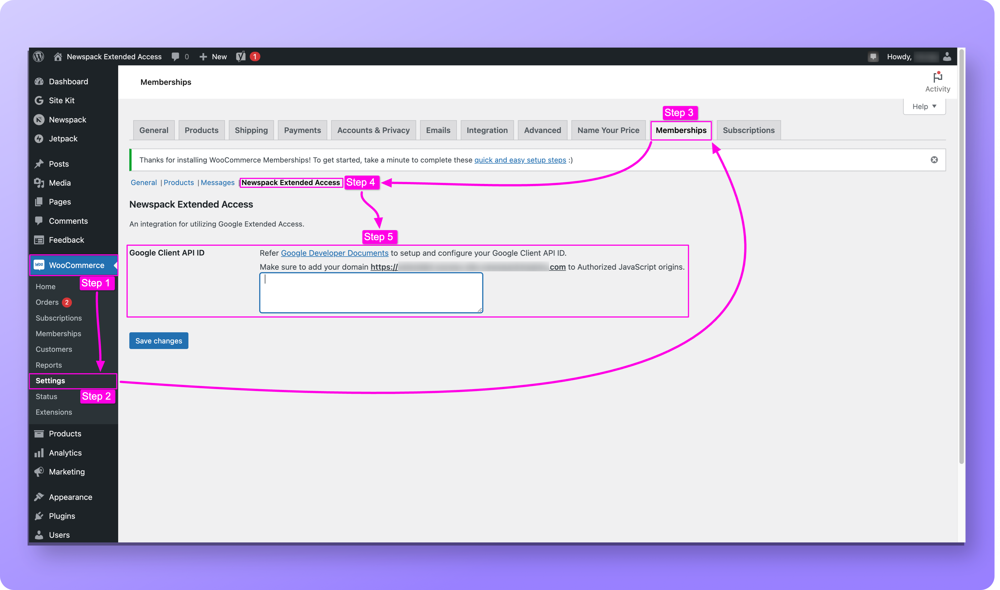

# Newspack Extended Access

Google Extended Access integration wrapper plugin for Newspack. The plugin enables readers to unlock free access to select paywalled articles on registration.

## Dependency

This plugin requires following plugin to be installed, configured and active:
- [Newspack Plugin](https://github.com/Automattic/newspack-plugin)
- [WooCommerce](https://github.com/woocommerce/woocommerce)
- [WooCommerce Memberships](https://woocommerce.com/products/woocommerce-memberships/)

## Configuration

This plugin requires a valid `Google Client API ID` specific to your Newspack Site domain. Please create a new `Google Client API ID` for your site, if not already created. Follow instruction provided on [Setting up Google Client API ID]([https://](https://developers.google.com/identity/gsi/web/guides/get-google-api-clientid)).

> Make sure [dependent plugins](#dependency) are installed, configured and active on your site.

### Setting up Google Client API ID

Login to you Newspack site dashboard as an `Administrator`:
1. Open `WooCommerce` menu
2. Select `Settings` menu
3. Select `Memberships` tab
4. Select sub-tab `Newspack Extended Access`
5. Add your valid `Google Client API ID`

## License

Newspack Extended Access is licensed under [GNU General Public License v3 (or later)](./LICENSE).
